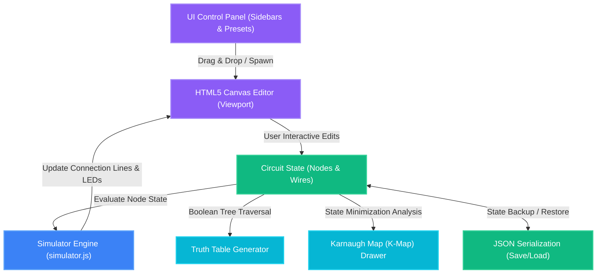
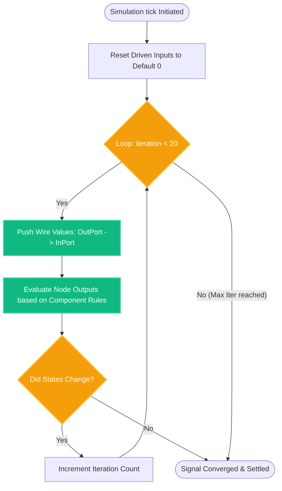
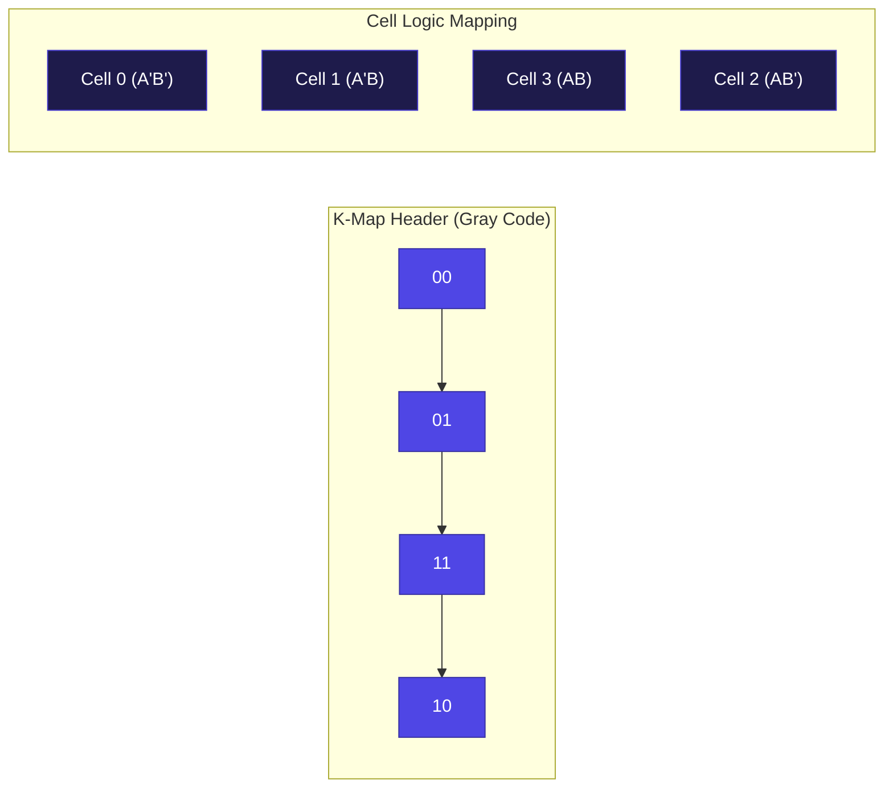
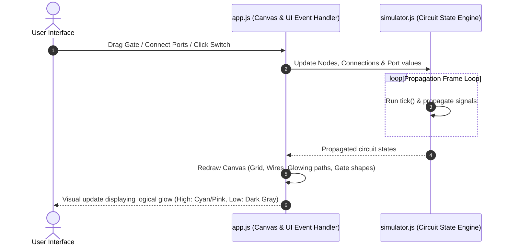

# 🌌 QuantumLogic — Advanced Digital Logic Simulator
<div>

  
  
  
</div>

---

**QuantumLogic** is a premium, high-fidelity, real-time **Digital Logic Design (DLD) Simulator** engineered to run entirely inside modern web browsers. Blending fluid glassmorphism aesthetics, responsive layouts, an interactive **HTML5 Canvas** editor, and a multi-pass signal propagation engine, QuantumLogic empowers users to design, test, analyze, and optimize digital logic circuits instantly.

Whether building standard logic combinational gates or complex sequential memory systems like clocked J-K flip-flops, QuantumLogic automatically traces propagation pathways, detects illegal feedforward cycles, evaluates logic states, and computes dynamic mathematical analyses like dynamic Truth Tables and Karnaugh Maps (K-Maps) on the fly.

---

## System Architecture

QuantumLogic is architected using highly decoupled, object-oriented JavaScript. The interface bridges the user interactions directly to the reactive simulation core.



---

## Core Simulation & Logic Engine

The core simulation is powered by `simulator.js`, defining mathematical nodes, component parameters, signal pathways, and propagation rules.

### 1. Cycle Detection & Memory Propagation
To maintain real-time stability without blocking the main browser thread, QuantumLogic separates **Combinational Circuits** from **Sequential Circuits (Flip-Flops)**:
*   **Combinational Cycle Detection:** When wires are dragged, the system runs a **Depth First Search (DFS)** cycle detection algorithm. If it detects a pure combinational loop (e.g., connecting a NOT gate output back to its own input, causing feedback instability), the system flags it.
*   **Sequential Feedback Loops:** Nodes with memory (SR, D, and JK Flip-Flops) break immediate combinational paths at clock edges. The DFS algorithm intelligently detects sequential flip-flops and allows those feedback paths (e.g., standard cross-coupled latches or loopback registers) to compile and execute safely.

### 2. Multi-Pass Signal Settling Engine (`tick()`)
Signals do not always travel in simple left-to-right directions. In complex circuits, output changes propagate back and forth until they reach steady states.
The `tick()` method implements a multi-pass propagation loop:



---

## Supported Components & Sub-circuits

QuantumLogic supports a broad range of inputs, outputs, basic logic gates, and complex sub-circuits out of the box:

| Category | Component Name | Identifier | Inputs | Outputs | Description |
| :--- | :--- | :--- | :---: | :---: | :--- |
| **I/O** | **Switch** | `INPUT` | `0` | `1` | Clickable switch toggling high ($1$) and low ($0$) logic. |
| **I/O** | **Clock Pulse** | `CLOCK` | `0` | `1` | High-frequency ticking pulse simulating systemic clock cycles. |
| **I/O** | **LED Bulb** | `OUTPUT` | `1` | `0` | Illuminating indicator lamp displaying current pin state. |
| **Basic Gates** | **NOT Gate** | `NOT` | `1` | `1` | Logic inverter ($Y = \overline{A}$). |
| **Basic Gates** | **AND Gate** | `AND` | `2` | `1` | Conjunction operator ($Y = A \cdot B$). |
| **Basic Gates** | **OR Gate** | `OR` | `2` | `1` | Disjunction operator ($Y = A + B$). |
| **Basic Gates** | **NAND Gate** | `NAND` | `2` | `1` | Inverted AND operator ($Y = \overline{A \cdot B}$). |
| **Basic Gates** | **NOR Gate** | `NOR` | `2` | `1` | Inverted OR operator ($Y = \overline{A + B}$). |
| **Basic Gates** | **XOR Gate** | `XOR` | `2` | `1` | Exclusive OR operator ($Y = A \oplus B$). |
| **Sub-circuits** | **Half Adder** | `HALF_ADDER` | `2` | `2` | Performs binary addition ($Sum$, $Carry$). |
| **Sub-circuits** | **Full Adder** | `FULL_ADDER` | `3` | `2` | Performs complete binary addition with Carry-In ($Sum$, $Carry\text{-}Out$). |
| **Sub-circuits** | **2:1 MUX** | `MUX` | `3` | `1` | Selects between two inputs based on a selection bit. |
| **Sub-circuits** | **1:2 DEMUX** | `DEMUX` | `2` | `2` | Directs single input to one of two outputs based on selection. |
| **Sequential** | **SR Flip-Flop** | `SR_FLIPFLOP` | `3` | `2` | Clocked Set-Reset flip-flop ($Q$, $\overline{Q}$) with unstable state handling. |
| **Sequential** | **D Flip-Flop** | `D_FLIPFLOP` | `2` | `2` | Edge-triggered Data storage element ($Q$, $\overline{Q}$). |
| **Sequential** | **JK Flip-Flop** | `JK_FLIPFLOP` | `3` | `2` | Edge-triggered universal storage element ($Q$, $\overline{Q}$) with toggle state. |

---

## Advanced Analytical Panel

QuantumLogic isn't just a simulator — it's a complete analysis utility that processes current logic configurations to produce dynamic academic outputs:

### Dynamic Truth Table
By hitting the **Compute** button in the sidebar panel:
1. The engine scans the workspace, isolating all active primary **Input Switches** and **LED Outputs**.
2. It constructs a lookup table matching unique input keys ($2^N$ combinations, supporting up to $N=5$ inputs for high performance).
3. The logic states are temporarily applied, evaluated, and mapped to display columns representing mathematical logic expressions such as `((A AND B) OR NOT C)`.
4. It instantly populates a high-contrast tabular dataset with styled highlight overlays for logic `1` and logic `0`.

### Karnaugh Maps (K-Maps)
To support circuit minimization, QuantumLogic builds dynamic **Karnaugh Maps**:
*   Supports **2-variable** ($A, B$), **3-variable** ($A, B, C$), and **4-variable** ($A, B, C, D$) Boolean expressions.
*   Calculates Gray code mappings for grid headers (e.g., `00`, `01`, `11`, `10`) to visualize correct neighboring adjacencies.
*   Instantly draws the grid showing logical $1$s, $0$s, and outputs, facilitating simple Boolean simplification directly inside the web browser.



---

## How the User Interface is Rendered

All logic gates, cables, ports, and states are drawn using custom-crafted graphics on an HTML5 `<canvas>` managed by `app.js`:



### Key UI Features
*   **High-contrast Glowing Paths:** Wires carrying High-Logic ($1$) illuminate with vibrant neon colors, while low paths fade into sleek dark mode lines.
*   **Smooth Drag-and-Drop:** Canvas workspace allows adding nodes by grabbing them from the left menu bar, positioning them anywhere, and dragging output pins to input pins.
*   **Zooming & Panning:** Integrated multi-touch mousewheel scroll zoom and spacebar-drag panning helps navigate massive multi-gate schematics easily.

---

## Serialization Format (Save & Load)

QuantumLogic exports the entire circuit state using clean JSON formatting, allowing users to share, edit, or recover progress.

### Sample Serialization Schema
```json
{
  "nodes": [
    {
      "id": "node_7k9a1z3x8",
      "type": "AND",
      "x": 240,
      "y": 180,
      "inputs": [1, 0],
      "outputs": [0]
    },
    {
      "id": "node_2l8c4v9n5",
      "type": "INPUT",
      "x": 80,
      "y": 120,
      "inputs": [],
      "outputs": [1],
      "state": { "value": 1 }
    }
  ],
  "wires": [
    {
      "fromNodeId": "node_2l8c4v9n5",
      "fromPortIdx": 0,
      "toNodeId": "node_7k9a1z3x8",
      "toPortIdx": 0,
      "value": 1
    }
  ]
}
```

---

## Getting Started & Local Development

No heavy compilation steps are required! QuantumLogic runs natively on vanilla modern web browsers.

### Directory Structure
```bash
dld-simulator/
│
├── index.html       # Application frame, Layout layout grids, panels, assets
├── style.css        # Rich glassmorphism aesthetics, glowing variables, styling systems
├── app.js           # Interactive viewport handler, Canvas events, mouse states
├── simulator.js     # Decoupled simulation propagation core, cycle checker, K-Maps
└── README.md        # Comprehensive technical guide (This file)
```

### Run it Instantly
1.  Double-click or open [index.html](file:///c:/Users/maffa/Desktop/dld%20simultaor/index.html) in any modern browser (Chrome, Edge, Firefox, Safari).
2.  Alternatively, serve locally using lightweight web servers:
    ```bash
    # Using Node.js
    npx serve .
    
    # Using Python
    python -m http.server 8000
    ```
3.  Navigate to `http://localhost:8000` (or the respective serving port) to access QuantumLogic.

---

<div align="center">
  <p>Crafted with 💖 for digital logic designers, students, and engineers alike.</p>
</div>
